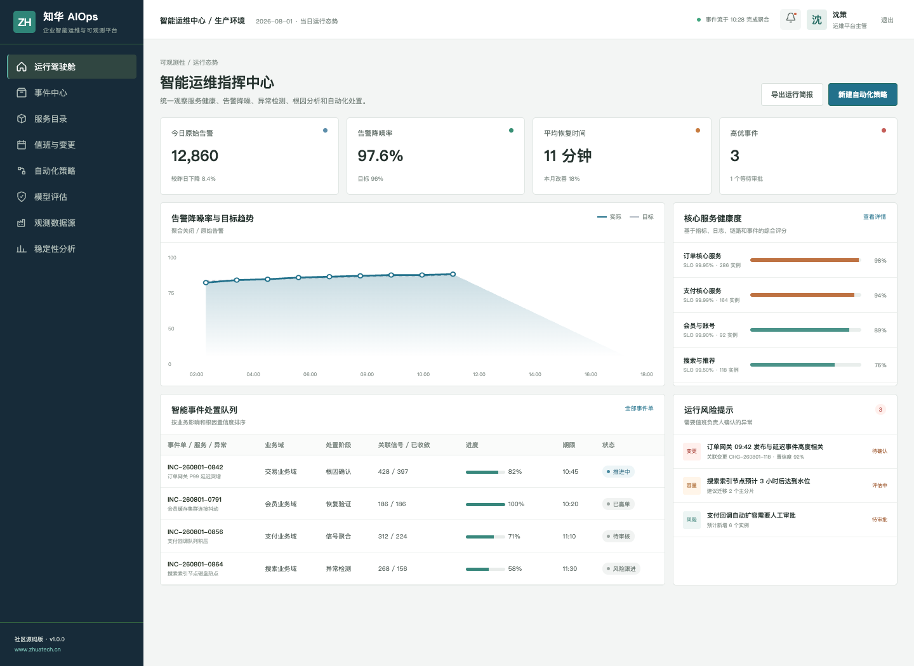
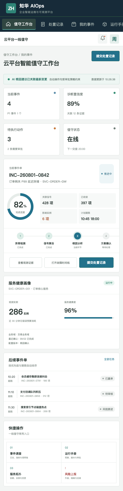

# ZhuaTech AIOps｜知华科技企业智能运维与可观测平台

> 用可观测数据、AI 根因分析与受控自动化，构建从异常发现到恢复验证的运维闭环。

[知华科技官网](https://www.zhuatech.cn/) · [架构说明](docs/architecture.md) · [API 文档](docs/api.md) · [部署指南](deploy/README.md)



## 平台解决什么问题

ZhuaTech AIOps 面向 SRE、运维中心与业务技术团队，将指标、日志、调用链、变更和告警统一为智能事件。平台提供告警聚合、异常检测、变更关联、根因建议、运行手册匹配、审批执行和恢复验证，并保留完整操作证据。

- 多源可观测数据与服务拓扑
- 告警降噪、事件聚合和影响分析
- AI 根因候选、证据链和置信度
- Runbook 推荐、审批、执行与回滚
- SLO、错误预算、MTTR 和复盘分析
- 可插拔 `AiProvider`，演示环境不包含真实模型密钥



## 工程结构

后端使用 Java 21、Spring Boot、Spring Security、JWT、JPA 与 Flyway，包名为 `cn.zhuatech.aiops`；前端使用 Vue 3、Pinia、Vue Router、Axios 与 Vite；生产数据库为 MySQL 8，测试数据库为 H2。

```bash
cd frontend
npm install
npm run dev:demo
```

访问 `http://localhost:5173`。演示账号：`planner / Demo@2026`（管理端）、`operator / Demo@2026`（值守端）。全栈运行可执行 `cp .env.example .env && docker compose up --build`。

## 使用边界

本工程仅限个人学习、研究与非商业技术交流，**不得商用**。企业内部使用、生产部署、SaaS 服务、项目交付、收费培训、品牌替换或商业再分发，均须事先取得上海如静知华信息科技有限公司书面授权，具体以 [LICENSE](LICENSE) 为准。

深度开发、私有化部署、模型接入或商业授权，请访问[知华科技官网](https://www.zhuatech.cn/)或扫码咨询：

| 微信咨询一 | 微信咨询二 |
| --- | --- |
|  |  |

SEO 关键词：AIOps 源码、智能运维平台、可观测性、告警降噪、根因分析、Java AIOps、Vue 运维系统、知华科技。
